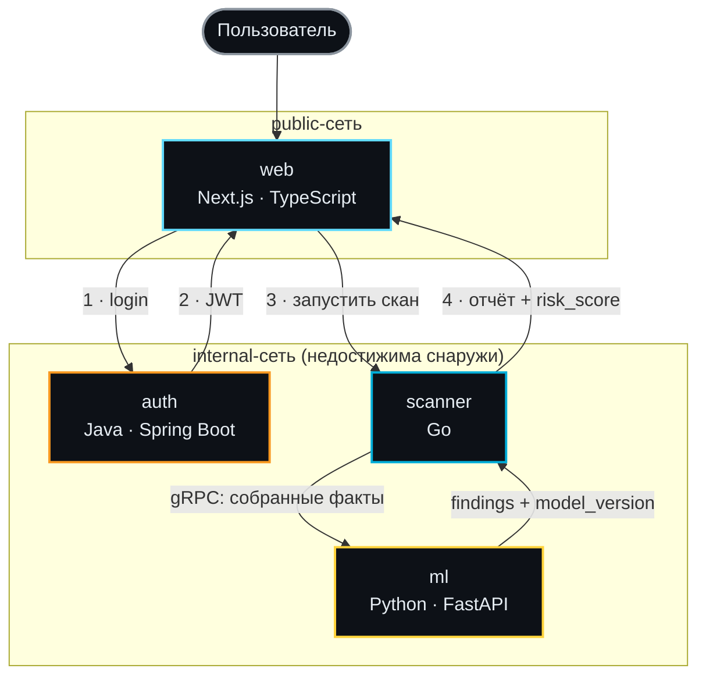

# sitefrisk

**ИИ-сканер веб-безопасности с собственной дообученной моделью детекции уязвимостей**

*Дипломный проект — в активной разработке.*

Замысел: сервис, который сканирует сайт на предмет уязвимостей и утечек данных, используя собственную дообученную (fine-tuned) языковую модель для анализа находок и генерации понятного отчёта с рекомендациями — не обёртку над сторонним LLM API, а модель, обученную именно под эту задачу.

[](LICENSE)
[]()

---

## Что это

Когда проект будет реализован, sitefrisk должен принимать URL сайта и:

1. **Собирать факты** о его безопасности — security-заголовки, TLS-конфигурацию, потенциально чувствительные открытые пути
2. **Анализировать** их с помощью собственной дообученной модели, классифицируя находки по таксономии [CWE](https://cwe.mitre.org/) и оценивая критичность
3. **Возвращать отчёт** — находки, их описание и конкретные рекомендации по исправлению

Ключевой акцент проекта — не интеграция готового LLM API, а **fine-tuning открытой модели** (LoRA/QLoRA) на датасетах реальных уязвимостей (CVEfixes, DiverseVul), с явным сравнением baseline vs fine-tuned как научным результатом. Прогресс по каждому из этих пунктов — в разделе [«Статус проекта»](#статус-проекта) ниже.

## Архитектура

Четыре сервиса на четырёх языках, каждый выбран под конкретную задачу, а не по привычке:



Стрелки пронумерованы по порядку задуманного запроса: `web` логинится в `auth` и получает JWT (1–2), затем тем же образом запускает скан и получает отчёт от `scanner` (3–4). Группировка по подграфам отражает разделение сетей в `docker-compose` — `auth`/`scanner`/`ml` физически недостижимы снаружи, весь трафик пользователя идёт только через `web`. **На практике часть этих связей (JWT-логин, полноценный отчёт) ещё не реализована** — см. статус ниже.

| Сервис | Язык | Роль |
|---|---|---|
| [`web`](services/web) | Next.js + TypeScript | Фронтенд, дашборд, отчёты |
| [`auth`](services/auth) | Java + Spring Boot | Аутентификация/авторизация, JWT, RBAC |
| [`scanner`](services/scanner) | Go | Пассивный сбор фактов о сайте, SSRF-guard |
| [`ml`](services/ml) | Python + FastAPI | Инференс дообученной модели детекции уязвимостей |

Подробнее об устройстве и локальной разработке scanner-сервиса — в его собственном [README](services/scanner/README.md).

Связи между сервисами: **gRPC** между Go и Python (типизированный контракт, см. [`contracts/scanner.proto`](contracts/scanner.proto)), **REST** — везде, где не нужна лишняя сложность.

## Стек

Микросервисная архитектура — каждый сервис самостоятелен: свой язык, свой `Dockerfile`, своя зона ответственности. Взаимодействие только через явные контракты (gRPC/REST), без общей базы кода или общего рантайма между сервисами.

| Категория | Технология |
|---|---|
| Frontend | Next.js 16 (App Router), TypeScript, SCSS |
| Auth | Java 21, Spring Boot 4.1.1, Spring Security |
| Scanner | Go 1.23 |
| ML | Python 3.12, FastAPI, HuggingFace PEFT (LoRA/QLoRA) |
| Межсервисная связь | gRPC (Go ↔ Python), REST (остальные связи) |
| Инфраструктура | Docker, docker-compose, сегментированные сети (`public` / `web-auth` / `web-scanner` / `scanner-ml`) |
| Структура репозитория | Monorepo |

## Быстрый старт

Сейчас поднимает только каркас сервисов (health-эндпоинты) — полноценного пользовательского сценария (скан → отчёт) пока нет, он в разработке.

```bash
git clone https://github.com/MiralSNk/sitefrisk.git
cd sitefrisk
cp .env.example .env
docker compose up --build
```

После запуска (локально):
- `http://localhost:3000` — фронтенд (пока заглушка)
- Остальные сервисы (`auth`, `scanner`, `ml`) доступны только внутри internal-сети docker-compose — это осознанное архитектурное решение, снижающее поверхность атаки

## Структура репозитория

```
sitefrisk/
├── docker-compose.yml
├── contracts/
│   └── scanner.proto        # gRPC-контракт Go ↔ Python
├── services/
│   ├── web/                 # Next.js
│   ├── auth/                # Java / Spring Boot
│   ├── scanner/              # Go
│   └── ml/                  # Python / FastAPI
└── .github/workflows/       # CI (по одному workflow на сервис)
```

## Статус проекта

- [x] Архитектура спроектирована, контракты между сервисами определены
- [x] Все 4 сервиса подняты и работают вместе через `docker-compose`
- [x] Первый стабильный тег — `v0.1.0` (MVP-каркас)
- [x] SSRF-guard в `scanner` (защита от DNS rebinding, приватных диапазонов, cloud-метадаты)
- [x] Первый рабочий коллектор фактов (`header`) — security-заголовки, покрытие тестами 84.2%
- [ ] gRPC-клиент `scanner → ml`
- [ ] JWT/RBAC в `auth`
- [ ] Подготовка датасета и fine-tuning модели в `ml`
- [ ] UI дашборда в `web`
- [ ] CI/CD
- [ ] Прочее (список будет расти по мере разработки)

## Безопасность

Это security-инструмент, поэтому к себе применяются те же принципы, что ищутся у других:

- Сканер делает исходящие запросы на произвольные пользовательские URL — защита от SSRF-атак на внутреннюю инфраструктуру уже реализована в `scanner` (см. его README)
- Сервисы, не обязанные быть публичными, изолированы во внутренней docker-сети
- Контейнеры работают от непривилегированного пользователя, без `root`

## Лицензия

[Apache License 2.0](LICENSE)

---